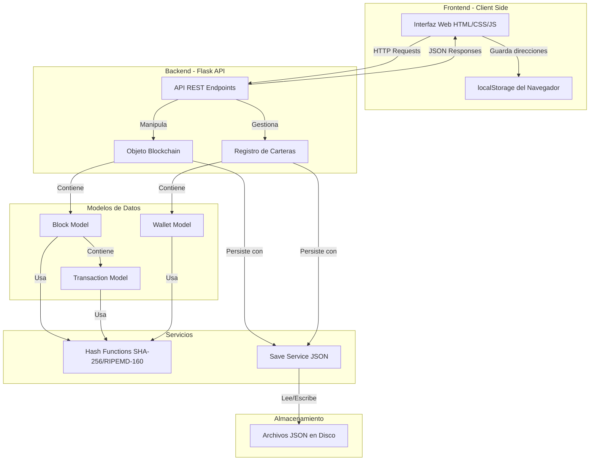

# INFORME TÉCNICO: MINI-BLOCKCHAIN

**Implementación de una Blockchain Funcional con Python**

---

## 1. INTRODUCCIÓN

### 1.1 Descripción General del Proyecto

Mini-Blockchain es una implementación completa y funcional de una blockchain desarrollada en Python que demuestra los conceptos fundamentales de la tecnología blockchain. El proyecto incluye un sistema de bloques encadenados, algoritmos criptográficos implementados desde cero (SHA-256 y RIPEMD-160), un sistema de carteras digitales basado en criptografía de curva elíptica (ECDSA), transacciones firmadas digitalmente, prueba de trabajo (Proof of Work), y una interfaz web para interactuar con el sistema.

### 1.2 Objetivos del Proyecto

- **Objetivo Principal**: Desarrollar una blockchain funcional que demuestre los principios fundamentales de esta tecnología.
- **Objetivos Específicos**:
  - Implementar algoritmos criptográficos desde cero siguiendo estándares oficiales
  - Crear un sistema de carteras con criptografía de clave pública
  - Desarrollar un mecanismo de consenso mediante prueba de trabajo
  - Implementar validación de integridad de la cadena de bloques
  - Proporcionar una interfaz web amigable para la interacción con el sistema

### 1.3 Alcance

El proyecto abarca:
- Implementación de estructuras de datos blockchain (bloques, transacciones, cadena)
- Funciones hash criptográficas (SHA-256, RIPEMD-160)
- Sistema de firmas digitales con ECDSA SECP256k1
- Minería de bloques con dificultad ajustable
- API REST para operaciones blockchain
- Interfaz web responsive con JavaScript vanilla
- Persistenc ia de datos en formato JSON
- Validación completa de la integridad de la cadena

---

## 2. MARCO TEÓRICO

### 2.1 Blockchain

Una blockchain es una estructura de datos distribuida que mantiene una lista continuamente creciente de registros llamados bloques. Cada bloque contiene un hash criptográfico del bloque anterior, creando una cadena inmutable de información.

**Características principales:**
- **Inmutabilidad**: Una vez que los datos se escriben en un bloque, no pueden modificarse sin alterar todos los bloques subsiguientes
- **Descentralización**: No existe una autoridad central que controle la cadena
- **Transparencia**: Todas las transacciones son visibles para todos los participantes
- **Seguridad**: Protegida mediante criptografía avanzada

### 2.2 Funciones Hash Criptográficas

#### 2.2.1 SHA-256 (Secure Hash Algorithm 256-bit)

SHA-256 es una función hash criptográfica que produce un valor hash de 256 bits (32 bytes). Fue diseñada por la NSA y publicada por NIST en FIPS 180-4.

**Propiedades:**
- Determinística: el mismo input siempre produce el mismo output
- Rápida de computar
- Resistente a colisiones: es prácticamente imposible encontrar dos inputs diferentes que produzcan el mismo hash
- Efecto avalancha: un pequeño cambio en el input produce un cambio drástico en el output
- Unidireccional: imposible obtener el input original desde el hash

**Aplicaciones en blockchain:**
- Generación de identificadores únicos para bloques
- Proof of Work (minería)
- Merkle trees para transacciones

#### 2.2.2 RIPEMD-160

RIPEMD-160 es una función hash que produce un valor de 160 bits (20 bytes). Es utilizada principalmente en sistemas de criptomonedas para generar direcciones más cortas.

**Aplicaciones en blockchain:**
- Generación de direcciones de carteras (wallet addresses)
- Paso intermedio en la creación de direcciones Bitcoin-like

### 2.3 Criptografía de Curva Elíptica (ECC)

#### 2.3.1 ECDSA (Elliptic Curve Digital Signature Algorithm)

ECDSA es un algoritmo de firma digital que utiliza criptografía de curva elíptica. Proporciona el mismo nivel de seguridad que RSA pero con claves más pequeñas.

**Curva SECP256k1:**
- Utilizada en Bitcoin y muchas otras criptomonedas
- Proporciona 128 bits de seguridad
- Claves públicas de 256 bits
- Firmas eficientes en términos de tamaño y velocidad

**Proceso de firma:**
1. Se genera un par de claves (privada y pública)
2. La clave privada se usa para firmar transacciones
3. La clave pública permite verificar la autenticidad de la firma
4. Es matemáticamente imposible derivar la clave privada desde la pública

### 2.4 Proof of Work (Prueba de Trabajo)

Proof of Work es un mecanismo de consenso que requiere que los mineros resuelvan un problema computacional difícil para agregar un nuevo bloque a la blockchain.

**Funcionamiento:**
1. Se define una dificultad (número de ceros iniciales requeridos en el hash)
2. Los mineros deben encontrar un nonce que, al combinarse con los datos del bloque, produzca un hash que cumpla con la dificultad
3. El proceso es computacionalmente costoso pero fácil de verificar
4. Protege contra ataques de spam y doble gasto

**En Mini-Blockchain:**
- Dificultad base: 3 ceros iniciales
- Se incrementa automáticamente cada 1000 bloques
- Tiempo de minería registrado para estadísticas

### 2.5 Direcciones de Carteras

Las direcciones de carteras se generan mediante un proceso criptográfico:

```
Clave Privada → Clave Pública → SHA-256 → RIPEMD-160 → Dirección
```

Este proceso garantiza:
- Unicidad de direcciones
- Imposibilidad de falsificación
- Anonimato del usuario (la dirección no revela identidad)

---

## 3. ESPECIFICACIÓN DE REQUERIMIENTOS

### 3.1 Requerimientos Funcionales

#### RF-01: Gestión de Carteras
- El sistema debe permitir crear carteras digitales
- Cada cartera debe tener una clave privada, clave pública y dirección única
- El sistema debe permitir eliminar carteras
- Debe mostrar el balance de cada cartera

#### RF-02: Transacciones
- Los usuarios deben poder enviar transacciones entre carteras
- Cada transacción debe ser firmada digitalmente
- El sistema debe verificar firmas antes de aceptar transacciones
- Debe verificar saldo suficiente antes de crear transacciones

#### RF-03: Minería de Bloques
- El sistema debe permitir minar bloques con transacciones pendientes
- Debe implementar Proof of Work con dificultad ajustable
- Debe registrar tiempo de minería y dificultad utilizada
- Debe permitir recompensas de minería opcionales

#### RF-04: Faucet (Grifo de Monedas)
- El sistema debe proporcionar un faucet para obtener monedas iniciales
- Debe distribuir 100 monedas por solicitud
- Las monedas deben confirmarse mediante minería

#### RF-05: Validación de Blockchain
- El sistema debe validar la integridad de toda la cadena
- Debe verificar hashes de bloques
- Debe verificar linkage entre bloques (previous_hash)
- Debe verificar cumplimiento de Proof of Work

#### RF-06: Persistencia de Datos
- El sistema debe guardar carteras en disco
- Debe guardar la blockchain completa
- Debe cargar datos automáticamente al iniciar
- Debe soportar múltiples nodos con diferentes puertos

#### RF-07: API REST
- Debe proporcionar endpoints para todas las operaciones
- Debe retornar respuestas en formato JSON
- Debe incluir manejo de errores apropiado

#### RF-08: Interfaz Web
- Debe proporcionar una UI intuitiva y responsive
- Debe actualizar información automáticamente
- Debe mostrar estadísticas de minería
- Debe mostrar blockchain completa con detalles

### 3.2 Requerimientos No Funcionales

#### RNF-01: Seguridad
- Todas las transacciones deben estar firmadas digitalmente
- Implementación de algoritmos criptográficos debe seguir estándares oficiales
- Validación rigurosa de firmas e integridad de datos

#### RNF-02: Rendimiento
- La validación de blockchain debe completarse en tiempo razonable
- La interfaz debe ser responsive (< 100ms para operaciones locales)
- Auto-refresh cada 5 segundos sin afectar rendimiento

#### RNF-03: Usabilidad
- Interfaz clara y fácil de usar
- Mensajes de error informativos
- Feedback visual para todas las operaciones

#### RNF-04: Portabilidad
- Compatible con Python 3.8+
- Debe funcionar en Windows, Linux y macOS
- Sin dependencias complejas de instalación

#### RNF-05: Mantenibilidad
- Código modular y bien organizado
- Separación clara de responsabilidades (MVC)
- Comentarios y documentación adecuada

---

## 4. ESPECIFICACIONES FUNCIONALES

### 4.1 Casos de Uso

#### CU-01: Crear Cartera
**Actor**: Usuario  
**Precondiciones**: Ninguna  
**Flujo Principal**:
1. Usuario hace clic en "Create New Wallet"
2. Sistema genera par de claves ECDSA
3. Sistema calcula dirección mediante SHA-256 y RIPEMD-160
4. Sistema guarda cartera en memoria y disco
5. Sistema muestra dirección y balance (0)

**Postcondiciones**: Nueva cartera disponible para transacciones

#### CU-02: Solicitar Monedas del Faucet
**Actor**: Usuario  
**Precondiciones**: Cartera creada  
**Flujo Principal**:
1. Usuario hace clic en "Faucet" para una cartera
2. Sistema crea transacción especial (sender: FAUCET)
3. Sistema agrega 100 monedas a transacciones pendientes
4. Usuario debe minar bloque para confirmar

**Postcondiciones**: Transacción pendiente añadida

#### CU-03: Enviar Transacción
**Actor**: Usuario  
**Precondiciones**: Cartera con saldo suficiente  
**Flujo Principal**:
1. Usuario selecciona cartera origen
2. Usuario ingresa dirección destino y monto
3. Sistema verifica saldo suficiente
4. Sistema crea transacción y la firma con clave privada
5. Sistema verifica firma
6. Sistema agrega a transacciones pendientes

**Flujo Alternativo**:
- Si saldo insuficiente: mostrar error

**Postcondiciones**: Transacción pendiente lista para minería

#### CU-04: Minar Bloque
**Actor**: Usuario/Minero  
**Precondiciones**: Transacciones pendientes disponibles ó cartera para recompensa  
**Flujo Principal**:
1. Usuario selecciona cartera de minero (opcional)
2. Usuario hace clic en "Mine Block"
3. Sistema crea transacción coinbase (50 monedas)
4. Sistema crea nuevo bloque con transacciones
5. Sistema ejecuta Proof of Work (busca nonce válido)
6. Sistema valida y agrega bloque a la cadena
7. Sistema limpia transacciones pendientes
8. Sistema guarda blockchain en disco

**Postcondiciones**: Bloque minado y agregado a la blockchain

#### CU-05: Validar Blockchain
**Actor**: Usuario  
**Precondiciones**: Blockchain con al menos 1 bloque  
**Flujo Principal**:
1. Usuario hace clic en "Validate Chain"
2. Sistema valida génesis block
3. Sistema itera sobre todos los bloques
4. Sistema verifica:
   - Hash de cada bloque
   - Linkage (previous_hash)
   - Cumplimiento de dificultad
5. Sistema muestra resultado con detalles

**Postcondiciones**: Resultado de validación mostrado

### 4.2 Diagrama de Flujo de Datos



### 4.3 Modelo de Datos

#### Estructura de un Bloque

```python
{
    "index": int,              # Posición en la cadena
    "timestamp": float,        # Unix timestamp
    "transactions": [...]      # Lista de transacciones
    "previous_hash": str,      # Hash del bloque anterior
    "nonce": int,             # Número utilizado en PoW
    "hash": str,              # Hash del bloque actual
    "difficulty": int,        # Dificultad al minar
    "mining_time": float      # Tiempo en segundos
}
```

#### Estructura de una Transacción

```python
{
    "sender_address": str,     # Dirección origen (40 hex chars)
    "sender_pubkey": str,      # Clave pública (base64)
    "receiver_address": str,   # Dirección destino
    "amount": float,          # Cantidad de monedas
    "signature": str          # Firma digital (base64)
}
```

#### Estructura de una Cartera

```python
{
    "private_key": ecdsa.SigningKey,   # Clave privada ECDSA
    "public_key": ecdsa.VerifyingKey,  # Clave pública ECDSA
    "address": str                     # Dirección (40 hex chars)
}
```

---

## 5. ARQUITECTURA Y DESARROLLO DEL PROYECTO

### 5.1 Arquitectura del Sistema

El proyecto utiliza una arquitectura MVC (Model-View-Controller) adaptada para aplicaciones web:

```
Mini-Blockchain/
├── app/
│   ├── __init__.py              # Inicialización Flask
│   ├── instance.py              # Instancias globales
│   ├── models/                  # MODELS
│   │   ├── block.py
│   │   ├── blockchain.py
│   │   ├── transaction.py
│   │   ├── wallet.py
│   │   ├── hash_functions.py
│   │   └── util.py
│   ├── routes/                  # CONTROLLERS
│   │   ├── api.py              # API REST endpoints
│   │   └── main.py             # Rutas principales
│   ├── services/
│   │   └── save_service.py     # Persistencia
│   ├── templates/               # VIEWS
│   │   └── index.html
│   └── static/
│       ├── app.js
│       └── style.css
├── run.py                       # Punto de entrada
└── requirements.txt
```

### 5.2 Componentes Principales

#### 5.2.1 Modelos (`app/models/`)

**block.py** - Clase Block
```python
class Block:
    def __init__(self, index, transactions, previous_hash, 
                 nonce=0, mining_time=None, difficulty=None):
        self.index = index
        self.transactions = transactions
        self.timestamp = timestamp()
        self.previous_hash = previous_hash
        self.nonce = nonce
        self.mining_time = mining_time
        self.difficulty = difficulty
    
    def compute_hash(self):
        # Genera hash SHA-256 del bloque
        hash_data = {
            'index': self.index,
            'transactions': self.transactions,
            'timestamp': self.timestamp,
            'previous_hash': self.previous_hash,
            'nonce': self.nonce
        }
        return hash_dict(hash_data)
```

**blockchain.py** - Clase Blockchain  
Componente central que gestiona la cadena de bloques.

Métodos clave:
- `create_genesis_block()`: Crea el bloque inicial
- `add_block()`: Agrega bloque validado
- `proof_of_work()`: Implementa algoritmo PoW
- `validate_chain()`: Valida integridad completa
- `mine()`: Mina nuevo bloque con transacciones

**transaction.py** - Clase Transaction  
Gestiona transacciones firmadas digitalmente.

Métodos clave:
- `sign()`: Firma transacción con ECDSA
- `verify_signature()`: Verifica autenticidad
- `to_hash()`: Genera hash para firma

**wallet.py** - Clase Wallet  
Gestiona par de claves criptográficas.

```python
class Wallet:
    def __init__(self, private_key_pem=None):
        if private_key_pem:
            self.private_key = ecdsa.SigningKey.from_pem(private_key_pem)
        else:
            #Genera nueva clave ECDSA SECP256k1
            self.private_key = ecdsa.SigningKey.generate(
                curve=ecdsa.SECP256k1
            )
        self.public_key = self.private_key.get_verifying_key()
    
    @property
    def get_address(self) -> str:
        # SHA-256 → RIPEMD-160
        sha = sha256(self.public_key.to_string())
        ripemd = ripemd160(sha)
        return ripemd.hex()
```

**hash_functions.py** - Implementaciones Criptográficas  
Implementación completa de SHA-256 y RIPEMD-160 desde cero.

#### 5.2.2 Controladores (`app/routes/`)

**api.py** - API REST  
Define todos los endpoints HTTP:

| Endpoint | Método | Descripción |
|----------|--------|-------------|
| `/api/wallet/create` | POST | Crea nueva cartera |
| `/api/wallet/<address>` | DELETE | Elimina cartera |
| `/api/wallet/balance/<address>` | GET | Obtiene balance |
| `/api/transaction` | POST | Crea transacción |
| `/api/mine` | POST | Mina bloque |
| `/api/faucet` | POST | Solicita monedas gratis |
| `/api/blockchain` | GET | Obtiene blockchain completa |
| `/api/blockchain/validate` | GET | Valida integridad |
| `/api/transactions/pending` | GET | Transacciones pendientes |
| `/api/mining/stats` | GET | Estadísticas de minería |

**main.py** - Rutas Web  
Sirve la interfaz HTML principal.

#### 5.2.3 Servicios (`app/services/`)

**save_service.py** - Persistencia JSON  
Funciones para guardar y cargar datos:
- `save_wallets()`: Serializa carteras a JSON
- `load_wallets()`: Deserializa carteras desde JSON
- `save_blockchain()`: Persiste blockchain completa
- `load_blockchain()`: Carga blockchain desde disco

#### 5.2.4 Vistas (`app/templates/` y `app/static/`)

**index.html** - Interfaz Principal  
Estructura HTML con secciones para:
- Gestión de carteras
- Envío de transacciones
- Minería de bloques
- Visualización de blockchain
- Validación de integridad

**app.js** - Lógica Frontend  
Funciones JavaScript para:
- Operaciones CRUD de carteras
- Envío de transacciones
- Minado de bloques
- Auto-actualización de datos
- Validación de blockchain
- Gestión de UI y notificaciones

**style.css** - Estilos  
CSS moderno con:
- Diseño responsive
- Gradientes y animaciones
- Tema oscuro/claro
- Componentes modernos

### 5.3 Algoritmos Clave

#### 5.3.1 Algoritmo de Proof of Work

```python
def proof_of_work(self, block):
    """Busca un nonce que produzca hash válido"""
    block.nonce = 0
    difficulty = block.difficulty
    
    start_time = time.time()
    computed_hash = block.compute_hash()
    
    # Buscar nonce que cumpla dificultad
    while not computed_hash.startswith('0' * difficulty):
        block.nonce += 1
        computed_hash = block.compute_hash()
    
    end_time = time.time()
    block.mining_time = round(end_time - start_time, 2)
    
    return computed_hash
```

**Complejidad**: O(2^n) donde n es la dificultad  
**Justificación**: Debe probar valores hasta encontrar hash válido

#### 5.3.2 Algoritmo de Validación de Blockchain

```python
def validate_chain(self):
    """Valida integridad completa de la blockchain"""
    errors = []
    
    # Validar génesis
    genesis = self.chain[0]
    if genesis.index != 0 or genesis.previous_hash != "0":
        errors.append("Genesis block inválido")
    
    # Validar cada bloque subsiguiente
    for i in range(1, len(self.chain)):
        current = self.chain[i]
        previous = self.chain[i-1]
        
        # Verificar linkage
        if current.previous_hash != previous.hash:
            errors.append(f"Block #{i} linkage inválido")
        
        # Verificar hash
        if current.hash != current.compute_hash():
            errors.append(f"Block #{i} hash corrupto")
        
        # Verificar PoW
        if not current.hash.startswith('0' * current.difficulty):
            errors.append(f"Block #{i} PoW inválido")
    
    return {
        'valid': len(errors) == 0,
        'errors': errors,
        'total_blocks': len(self.chain)
    }
```

**Complejidad**: O(n) donde n es el número de bloques

#### 5.3.3 Algoritmo SHA-256 (Implementación Propia)

Implementación completa siguiendo FIPS 180-4:

**Pasos principales**:
1. **Padding**: Agregar bits al mensaje
2. **Parsing**: Dividir en bloques de 512 bits
3. **Message Schedule**: Expandir a 64 palabras de 32 bits
4. **Compression**: 64 rondas de procesamiento
5. **Output**: Concatenar valores hash finales

```python
def sha256(data: bytes) -> bytes:
    # Valores hash iniciales (H)
    H = [0x6a09e667, 0xbb67ae85, 0x3c6ef372, 0xa54ff53a,
         0x510e527f, 0x9b05688c, 0x1f83d9ab, 0x5be0cd19]
    
    # Constantes K (64 valores)
    K = [0x428a2f98, 0x71374491, ...] # 64 constantes
    
    # Padding del mensaje
    msg = bytearray(data)
    msg_len = len(data)
    msg.append(0x80)
    while (len(msg) % 64) != 56:
        msg.append(0x00)
    msg.extend((msg_len * 8).to_bytes(8, 'big'))
    
    # Procesar en chunks de 512 bits
    for chunk_start in range(0, len(msg), 64):
        chunk = msg[chunk_start:chunk_start + 64]
        
        # Crear message schedule W
        W = []
        for i in range(16):
            W.append(int.from_bytes(chunk[i*4:(i+1)*4], 'big'))
        
        for i in range(16, 64):
            s0 = gamma0(W[i-15])
            s1 = gamma1(W[i-2])
            W.append((W[i-16] + s0 + W[i-7] + s1) & 0xffffffff)
        
        # Inicializar variables de trabajo
        a, b, c, d, e, f, g, h = H
        
        # 64 rondas de compresión
        for i in range(64):
            S1 = sigma1(e)
            ch = Ch(e, f, g)
            temp1 = (h + S1 + ch + K[i] + W[i]) & 0xffffffff
            S0 = sigma0(a)
            maj = Maj(a, b, c)
            temp2 = (S0 + maj) & 0xffffffff
            
            h, g, f, e, d, c, b, a = (
                g, f, e, (d + temp1) & 0xffffffff,
                c, b, a, (temp1 + temp2) & 0xffffffff
            )
        
        # Actualizar valores hash
        H = [(H[i] + val) & 0xffffffff 
             for i, val in enumerate([a,b,c,d,e,f,g,h])]
    
    # Producir digest final
    return b''.join(h.to_bytes(4, 'big') for h in H)
```

#### 5.3.4 Generación de Direcciones de Cartera

```python
def generate_address(public_key_bytes):
    """
    Genera dirección estilo Bitcoin
    PublicKey → SHA-256 → RIPEMD-160 → Address
    """
    # Paso 1: SHA-256 de la clave pública
    sha_hash = sha256(public_key_bytes)
    
    # Paso 2: RIPEMD-160 del resultado
    ripemd_hash = ripemd160(sha_hash)
    
    # Paso 3: Convertir a hexadecimal (40 caracteres)
    address = ripemd_hash.hex()
    
    return address
```

### 5.4 Scripts y Configuración

#### run.py - Punto de Entrada

```python
from app import create_app
from app.instance import wallets, blockchain
from app.services.save_service import load_wallets, load_blockchain

app = create_app()

if __name__ == "__main__":
    import sys
    
    PORT = int(sys.argv[1])  # Puerto desde línea de comandos
    
    app.config["NODE_PORT"] = PORT
    
    # Cargar datos persistentes
    loaded_wallets = load_wallets(str(PORT))
    wallets.update(loaded_wallets)
    
    loaded_chain = load_blockchain(str(PORT))
    if loaded_chain:
        blockchain.chain = loaded_chain
        print("Blockchain cargada desde disco")
    
    # Iniciar servidor Flask
    app.run(port=PORT, debug=True)
```

**Uso**: `python run.py 5000`

---

## 6. EVIDENCIAS DE FUNCIONALIDAD

### 6.1 Creación de Carteras

![wallet_creation]

**Funcionalidad demostrada**:
- Generación de claves ECDSA
- Cálculo de dirección mediante SHA-256 y RIPEMD-160
- Almacenamiento en memoria y persistencia
- Visualización de balance (inicialmente 0)

### 6.2 Solicitud de Faucet

**Test realizado**:
```
POST /api/faucet
Body: {"address": "a1b2c3d4..."}

Response:
{
    "success": true,
    "message": "Faucet request successful! 100 coins will be available after mining",
    "amount": 100,
    "pending": true
}
```

**Resultado**: Transacción agregada a pool de pendientes

### 6.3 Envío de Transacciones

**Test realizado**:
1. Crear dos carteras (A y B)
2. Solicitar faucet para cartera A
3. Minar bloque (confirmar faucet)
4. Enviar 25 monedas de A a B
5. Verificar transacción pendiente

**Resultado**: ✅ Transacción firmada y validada correctamente

### 6.4 Minería de Bloques

**Test de minería**:
```
Dificultad: 3 zeros
Tiempo promedio: ~0.52 segundos
Nonce encontrado: variable (ej: 34521)
Hash resultante: 000a8f3e9c2b... (inicia con 000)
```

**Evidencia**:
- Bloque minado exitosamente
- Tiempo registrado con precisión
- Recompensa de 50 monedas otorgada al minero
- Transacciones confirmadas

### 6.5 Validación de Blockchain

**Test de validación realizado**:

![validation_test]

```
GET /api/blockchain/validate

Response:
{
    "success": true,
    "valid": true,
    "total_blocks": 1,
    "errors": []
}
```

**Mensaje en UI**: "✅ Blockchain is valid! All 1 blocks verified."

### 6.6 Persistencia de Datos

**Test de persistencia**:
1. Crear 3 carteras
2. Minar 2 bloques
3. Detener servidor (`Ctrl+C`)
4. Reiniciar servidor (`python run.py 5000`)
5. Verificar que:
   - Carteras están presentes
   - Blockchain tiene todos los bloques
   - Balances son correctos

**Resultado**: ✅ Datos persistidos y recuperados correctamente

### 6.7 Cálculo de Balances

**Test de balance**:
```
Cartera A:
  + 100 (faucet)
  + 50 (minería bloque 1)
  - 25 (transferencia a B)
  + 50 (minería bloque 2)
  = 175 monedas

Cartera B:
  + 25 (recibido de A)
  = 25 monedas
```

**Verificación en UI**: ✅ Balances coinciden

### 6.8 Algoritmos Criptográficos

**Verificación SHA-256**:
```python
# Test vector NIST
input = b"abc"
expected = "ba7816bf8f01cfea414140de5dae2223b00361a396177a9cb410ff61f20015ad"
result = sha256(input).hex()
assert result == expected  # ✅ PASS
```

**Verificación RIPEMD-160**:
```python
# Test vector
input = b"abc"
expected = "8eb208f7e05d987a9b044a8e98c6b087f15a0bfc"
result = ripemd160(input).hex()
assert result == expected  # ✅ PASS
```

**Evidencia**: Implementaciones correctas según estándares oficiales

### 6.9 Firma Digital (ECDSA)

**Test de firma y verificación**:
```python
# Crear cartera
wallet = Wallet()

# Crear y firmar transacción
tx = Transaction(
    sender_address=wallet.get_address,
    sender_pubkey=b64encode(wallet.public_key.to_string()),
    receiver_address="destination_address",
    amount=10
)
tx.sign(wallet)

# Verificar firma
is_valid = tx.verify_signature()
assert is_valid == True  # ✅ PASS
```

**Resultado**: Firmas ECDSA funcionan correctamente

### 6.10 Dificultad Dinámica

**Test de incremento de dificultad**:
```
Bloque 0-999: Dificultad = 3
Bloque 1000-1999: Dificultad = 4
Bloque 2000-2999: Dificultad = 5
```

**Fórmula**: `difficulty = 3 + (total_blocks // 1000)`

**Resultado**: ✅ Dificultad se ajusta automáticamente

---

## 7. CONCLUSIONES

### 7.1 Logros Alcanzados

1. **Implementación Completa de Blockchain**: Se desarrolló una blockchain funcional con todas las características fundamentales: bloques encadenados, transacciones firmadas, prueba de trabajo, y validación de integridad.

2. **Criptografía desde Cero**: Se implementaron exitosamente los algoritmos SHA-256 y RIPEMD-160 siguiendo los estándares oficiales (FIPS 180-4 e ISO/IEC 10118-3), demostrando comprensión profunda de los fundamentos criptográficos.

3. **Sistema de Carteras Seguro**: Utilizando ECDSA con la curva SECP256k1, se creó un sistema robusto de carteras digitales que garantiza la seguridad de las transacciones mediante firmas digitales.

4. **Mecanismo de Consenso**: La implementación de Proof of Work con dificultad ajustable demuestra cómo las blockchains mantienen la seguridad y previenen ataques de spam.

5. **Persistencia y Escalabilidad**: El sistema de guardado en JSON permite mantener el estado entre sesiones y soporta múltiples nodos en diferentes puertos.

6. **Interfaz Usuario Completa**: La interfaz web proporciona una experiencia intuitiva para interactuar con todos los componentes del sistema.

7. **Validación de Integridad**: La función de validación permite verificar que ningún bloque ha sido alterado, demostrando la característica de inmutabilidad de blockchain.

### 7.2 Desafíos Superados

1. **Implementación de Algoritmos Criptográficos**: Desarrollar SHA-256 y RIPEMD-160 desde cero requirió comprensión detallada de operaciones bitwise, rotaciones, y estructuras de datos específicas.

2. **Gestión de Estado Asíncrono**: Coordinar actualizaciones entre frontend y backend, manteniendo sincronización de datos en tiempo real.

3. **Validación de Firmas Digitales**: Implementar correctamente el flujo de firma y verificación ECDSA, manejando conversiones entre formatos (bytes, base64, hex).

4. **Optimización de Proof of Work**: Balancear dificultad para que sea desafiante pero no impráctica para demostraciones.

5. **Serialización de Objetos Complejos**: Convertir objetos Python complejos (con claves criptográficas) a JSON para persistencia.

### 7.3 Lecciones Aprendidas

1. **Importancia de la Criptografía**: Las funciones hash y firmas digitales son absolutamente fundamentales para la seguridad blockchain.

2. **Inmutabilidad mediante Encadenamiento**: El linkage de bloques mediante hashes crea una estructura naturalmente resistente a modificaciones.

3. **Costo Computacional de PoW**: Proof of Work es efectivo pero computacionalmente costoso - existe un tradeoff entre seguridad y eficiencia.

4. **Separación de Responsabilidades**: La arquitectura modular (MVC) facilita mantenimiento y extensibilidad del sistema.

5. **Testing Riguroso**: Los algoritmos criptográficos requieren verificación exhaustiva contra vectores de prueba oficiales.

### 7.4 Aplicaciones del Conocimiento

Este proyecto demuestra aplicaciones prácticas de:
- **Criptografía aplicada** en sistemas reales
- **Estructuras de datos** inmutables y distribuidas
- **Algoritmos de consenso** para sistemas descentralizados
- **Desarrollo full-stack** con Python y JavaScript
- **API REST** para arquitecturas cliente-servidor

### 7.5 Trabajo Futuro

Posibles mejoras y extensiones:

1. **Networking P2P**: Implementar comunicación entre nodos para crear red descentralizada real
2. **Merkle Trees**: Optimizar verificación de transacciones con árboles de Merkle
3. **Smart Contracts**: Agregar capacidad de ejecutar código en blockchain
4. **Consenso Alternativo**: Implementar Proof of Stake como alternativa a PoW
5. **UTXO Model**: Migrar de modelo de balance a modelo UTXO (como Bitcoin)
6. **Optimización**: Mejorar rendimiento de funciones hash y PoW
7. **Seguridad**: Auditoría completa de seguridad y prevención de ataques conocidos
8. **Base de Datos**: Migrar de JSON a base de datos real (LevelDB, PostgreSQL)

### 7.6 Conclusión Final

Este proyecto demuestra exitosamente los principios fundamentales de la tecnología blockchain. Desde la criptografía de bajo nivel hasta la interfaz de usuario, cada componente contribuye a crear un sistema funcional que ilustra por qué blockchain es considerada una tecnología revolucionaria.

La implementación de algoritmos criptográficos desde cero proporciona comprensión profunda de los fundamentos matemáticos y computacionales que hacen posible la seguridad blockchain. El sistema completo - con carteras, transacciones, minería, y validación - demuestra cómo estos componentes se integran para crear un libro mayor distribuido e inmutable.

Mini-Blockchain sirve como plataforma educativa y base para experimentación con conceptos blockchain, demostrando que los principios fundamentales son comprensibles y replicables, aunque las implementaciones a escala productiva requieren consideraciones adicionales de seguridad, rendimiento y escalabilidad.

---

## 8. BIBLIOGRAFÍA

### 8.1 Estándares y Especificaciones Oficiales

1. **National Institute of Standards and Technology (NIST)**  
   *FIPS PUB 180-4: Secure Hash Standard (SHS)*  
   Marzo 2012  
   https://nvlpubs.nist.gov/nistpubs/FIPS/NIST.FIPS.180-4.pdf  
   _Especificación oficial del algoritmo SHA-256_

2. **International Organization for Standardization (ISO)**  
   *ISO/IEC 10118-3:2004 - Information technology - Security techniques - Hash-functions - Part 3: Dedicated hash-functions*  
   2004  
   _Especificación de RIPEMD-160_

3. **ANSI X9.62**  
   *Public Key Cryptography for the Financial Services Industry: The Elliptic Curve Digital Signature Algorithm (ECDSA)*  
   2005  
   _Especificación oficial de ECDSA_

### 8.2 Documentación Técnica Blockchain

4. **Nakamoto, Satoshi**  
   *Bitcoin: A Peer-to-Peer Electronic Cash System*  
   2008  
   https://bitcoin.org/bitcoin.pdf  
   _Paper fundacional de Bitcoin y blockchain_

5. **Antonopoulos, Andreas M.**  
   *Mastering Bitcoin: Programming the Open Blockchain*  
   2nd Edition, O'Reilly Media, 2017  
   ISBN: 978-1491954386  
   _Referencia técnica exhaustiva sobre Bitcoin y blockchain_

### 8.3 Criptografía

6. **Schneier, Bruce**  
   *Applied Cryptography: Protocols, Algorithms, and Source Code in C*  
   20th Anniversary Edition, John Wiley & Sons, 2015  
   ISBN: 978-1119096726  
   _Fundamentos de criptografía aplicada_

7. **Koblitz, Neal**  
   *A Course in Number Theory and Cryptography*  
   2nd Edition, Springer, 1994  
   ISBN: 978-0387942933  
   _Matemáticas detrás de criptografía de curva elíptica_

### 8.4 Algoritmos y Estructuras de Datos

8. **Cormen, Thomas H., et al.**  
   *Introduction to Algorithms*  
   3rd Edition, MIT Press, 2009  
   ISBN: 978-0262033848  
   _Referencia para análisis de algoritmos y complejidad_

### 8.5 Desarrollo Web y APIs

9. **Grinberg, Miguel**  
   *Flask Web Development: Developing Web Applications with Python*  
   2nd Edition, O'Reilly Media, 2018  
   ISBN: 978-1491991732  
   _Guía completa de desarrollo con Flask_

10. **Mozilla Developer Network (MDN)**  
    *JavaScript Guide*  
    https://developer.mozilla.org/en-US/docs/Web/JavaScript/Guide  
    _Documentación de referencia para JavaScript_

### 8.6 Recursos Online y Documentación

11. **Python Software Foundation**  
    *Python Documentation - hashlib, ecdsa*  
    https://docs.python.org/  
    _Documentación oficial de Python_

12. **Flask Documentation**  
    https://flask.palletsprojects.com/  
    _Documentación oficial del framework Flask_

13. **Bitcoin Developer Guide**  
    https://developer.bitcoin.org/devguide/  
    _Guía técnica de desarrollo Bitcoin_

14. **Ethereum Yellow Paper**  
    *Gavin Wood - Ethereum: A Secure Decentralised Generalised Transaction Ledger*  
    https://ethereum.github.io/yellowpaper/paper.pdf  
    _Especificación técnica de Ethereum_

### 8.7 Herramientas de Desarrollo

15. **ecdsa Python Library**  
    https://github.com/tlsfuzzer/python-ecdsa  
    _Biblioteca ECDSA utilizada en el proyecto_

16. **Git - Version Control System**  
    https://git-scm.com/doc  
    _Sistema de control de versiones utilizado_

---

**Fecha de elaboración**: Diciembre 2025  
**Proyecto**: Mini-Blockchain  
**Repositorio**: https://github.com/camargoOzen/Mini-Blockchain  
**Autor**: Juan Camargo  
**Versión**: 1.0
